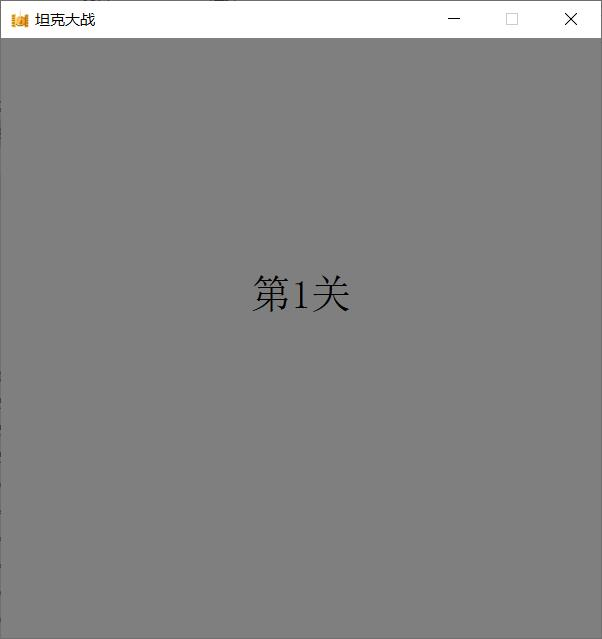
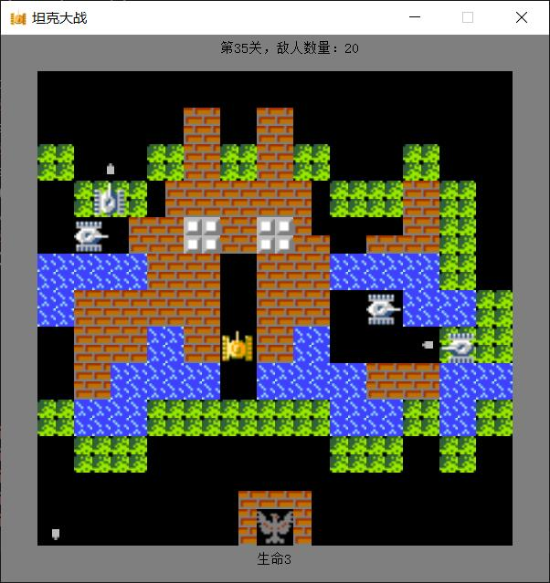
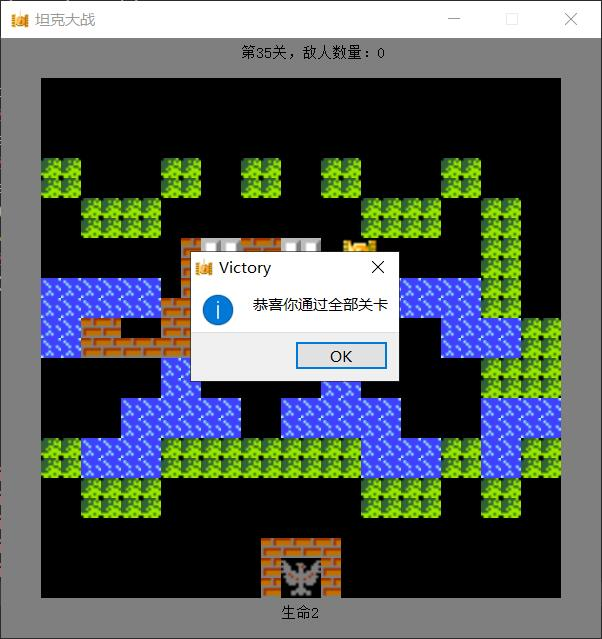
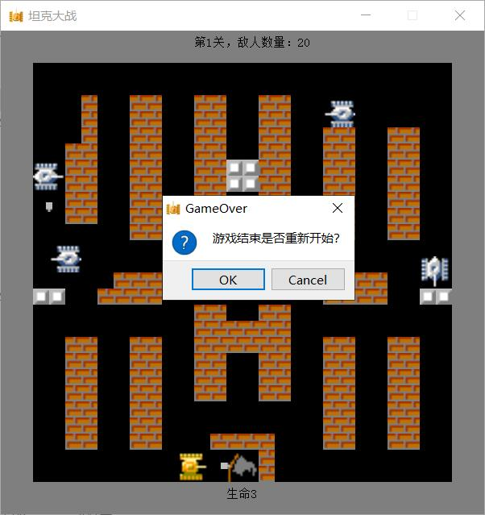
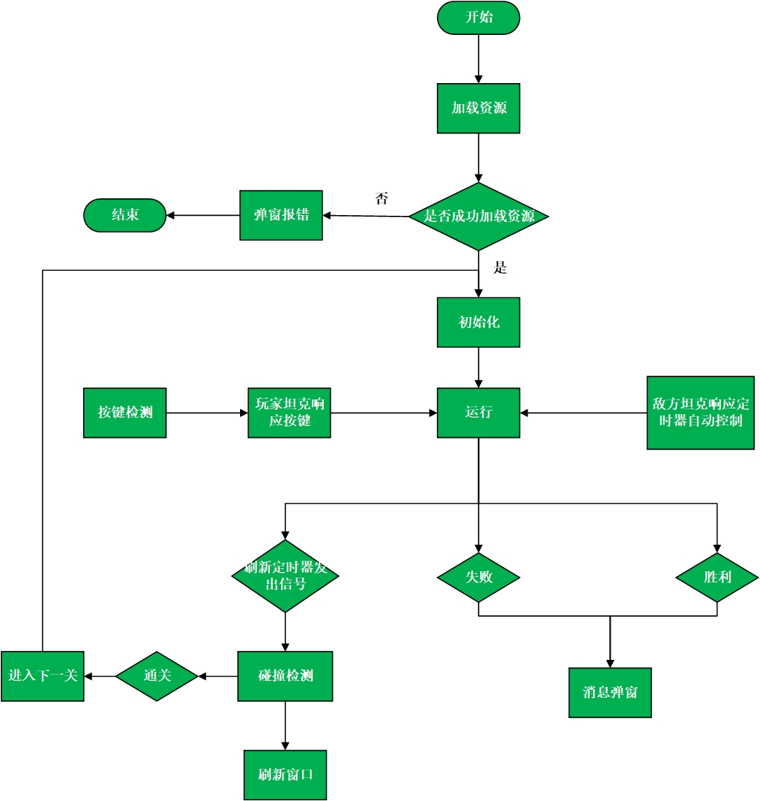
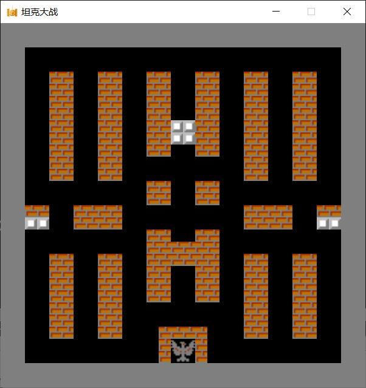
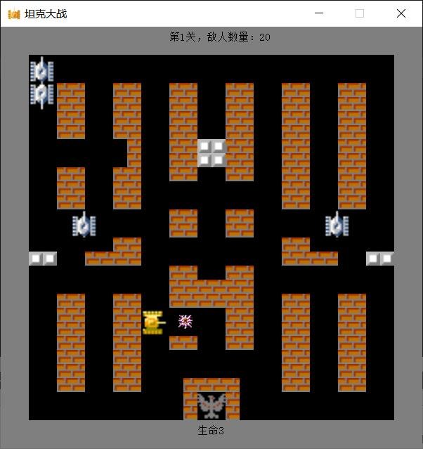
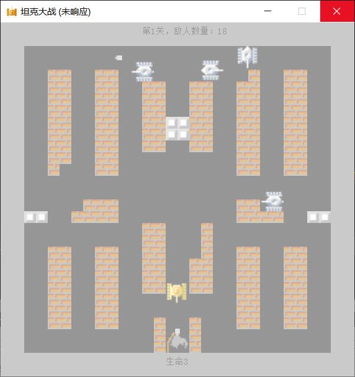
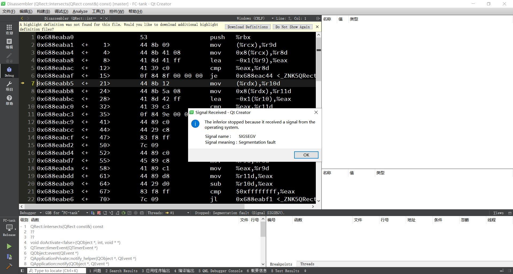

<center><h1 >坦克大战</h1></center>


## 一、环境

- 语言：C++

- 编译器：gcc version 7.3.0

- 应用程序开发框架：Qt version 5.14.1

- 集成开发环境：Qt Creator 4.11.0 (Community)


## 二、游戏总体介绍

### 1.设计规则

该游戏总共有35关，每关有20个敌方坦克，玩家每关3条命，因为是在个人电脑上玩所以仅实现了单人游戏

击败20个敌人自动进入下一关，通过35关游戏胜利，当生命数为0或大本营被击中游戏失败

玩家坦克由键盘W、S、A、D键控制移动方向，J键发射子弹，敌方坦克则自动控制

### 2.效果展示图













### 3.UML 类图


### 4.运行流程图




## 三、全局参数的设置

### 1.定义全局参数

我们的全局参数主要是枚举类型方向，地图数组，图像的单位尺寸，窗口长和宽

用一个config.h头文件来设置这些全局参数，并由其他类进行include

### 2.遇到的问题

按照上面的方式写好代码进行编译时发生了变量的重复定义报错（已经进行了宏定义防止头文件多次包含）

后来经过跟踪报错发现子弹类包含了一个map数组，而坦克类中也有map数组，两者分开是不会互相影响的，但把这两个对象放到Widget对象中就会发生冲突

### 3.解决方法

在config.h中指明变量为外部变量，把具体变量定义到config.cpp中

这样子弹类和坦克类所包含的同名变量都为同一个外部变量，且指向同一个地址


## 四、主要代码

### 1.初始化

游戏初始化时先加载资源文件，各定时器开始计时，创建玩家角色，和敌方坦克

我们规定地图上最多只能有四个敌方坦克，用enemyNum变量记录剩余敌人数量，用cursor来标记出生点的位置

用enemies列表来储存敌方坦克对象

```cpp
void Widget::init()
{
    //加载地图
    loadMap();

    camp.load((rootdir+"pic\\camp0.gif").c_str());
    camp = resizePic(camp,SIZE,SIZE);

    QSound::play((rootdir+"sound\\start.wav").c_str());
    //创建敌人
    cursor=0;
    enemyNum = 20;
    for(int i=0;i<4;i++)
    {
        createEnemy();
    }
    //创建玩家
    createPlayer();
    life = 3;
    // 开始游戏
    start = 30;
    timer1->start(120);
    timer2->start(150);
    timer3->start(1000);
    timer4->start(60);
    timer5->start(33);
}

void Widget::createPlayer()
{
    role1.bullet.setActive(false);
    role1.setDir(direct::up);
    role1.ismove=false;
    role1.rect.setRect(9*BASESIZE,24*BASESIZE,SIZE,SIZE);
}

void Widget::createEnemy()
{
    if(enemyNum<4)
        return;
    Enemy enemy;
    enemy.rect.setRect(cursor*SIZE,0,SIZE,SIZE);
    enemies.push_back(enemy);
    cursor+=6;
    cursor%=18;
}
```

###  2.图像统一大小

使用Qt中QPixmap类的scaled函数来改变图像的尺寸

```cpp
QPixmap QPixmap::scaled(const QSize &size, Qt::AspectRatioMode aspectRatioMode = Qt::IgnoreAspectRatio, Qt::TransformationMode transformMode = Qt::FastTransformation) const
```


### 3.地图设置

游戏界面分为26行26列由二维字符数组map保存地图内容，其设定如下所示

| 数据内容 | 地图类型 |
| :------: | :------: |
|    0     |   空白   |
|    1     |   草地   |
|    2     |   冰块   |
|    3     |   砖块   |
|    4     |   海洋   |
|    5     |   钢铁   |

游戏初始化时从map.dat文件中读取数据，根据map来绘制游戏界面的地形

``` cpp
void Widget::loadMap()
{
    std::ifstream file;
    try
    {
        file.open((QCoreApplication::applicationDirPath()+"\\res\\map.dat").toStdString().c_str(),std::ios::in|std::ios::binary);
        if(!file)
        {
            throw "无法加载地图，请确保可执行文件所在目录的res目录下有map.dat文件，并且该游戏不放在中文目录下";
        }

    }
    catch(const char *err)
    {
        QMessageBox msg(QMessageBox::Icon(QMessageBox::Icon::Critical),"ERROR",err);
        msg.exec();
        exit(-1);

    }
    file.seekg(sizeof(map)*(gate-1));
    file.read(*map,sizeof(map));
    file.close();
}

void Widget::drawMap()
{
    for (int i=0;i<26;i++)
    {
        for(int j=0;j<26;j++)
        {
            if(map[i][j]=='3')
            {
                paint.drawPixmap(j*BASESIZE,i*BASESIZE,brick);
            }
            else if(map[i][j]=='5')
            {
                paint.drawPixmap(j*BASESIZE,i*BASESIZE,iron);
            }
            else if(map[i][j]=='1')
            {
                paint.drawPixmap(j*BASESIZE,i*BASESIZE,grass);
            }
            else if(map[i][j]=='4')
            {
                paint.drawPixmap(j*BASESIZE,i*BASESIZE,water);
            }
            else if(map[i][j]=='2')
            {
                paint.drawPixmap(j*BASESIZE,i*BASESIZE,ice);
            }
        }
    }
    paint.drawPixmap(campRect.x(),campRect.y(),camp);
}
```





### 3.窗口绘制

Qt的QWidget类提供了绘制窗口的虚函数，我们直接重载就能实现窗口的绘制，当界面更新时自动调用该函数

界面更新函数：`update();`由定时器定时调用

```cpp
void paintEvent(QPaintEvent *) override;
```

这里主要是在窗口内绘制图像，我们只要根据各对象的坐标、方向和对应的图像然后调用QPainter类的drawPixmap 成员函数来在指定位置绘制指定图像

具体实现如下

```cpp
void Widget::paintEvent(QPaintEvent *)
{
    paint.begin(this);

    //画关卡过渡界面
    if(0<start--)
    {
        drawStart();
        paint.end();
        return;
    }
    //转换坐标系统
    paint.save();
    paint.translate(SIZE,SIZE);

    //画地图
    drawMap();

    //画玩家坦克
    static bool state=true;
    role1.display(paint,state);
    state = !state;
    //画玩家子弹
    role1.bullet.display(paint);
    if(role1.bullet.bump)
    {
        role1.bullet.showExplosion(paint);
    }
    // 画敌人
    for(auto& enemy:enemies)
    {
        //画子弹
        enemy.bullet.display(paint);
        if(enemy.bullet.bump)
        {
            enemy.bullet.showExplosion(paint);
        }
        //画坦克
        enemy.display(paint,state);
    }

    //重置坐标系统
    paint.restore();

    //画边框
    drawFrame();
    //画信息面板
    drawPanel();

    paint.end();

}
```





### 4.播放游戏音效

可以直接使用Qt自带的QSound类的静态方法 play 播放音效

```cpp
[static] void QSound::play(const QString &filename)
```


### 5.按键检测

Qt提供了按键检测的虚函数，同窗口绘制函数一样我们只需要重载它们就能实现其功能，只要按下键盘就会自动调用该函数，然后根据响应的按键来设置玩家坦克的方向和改变运动状态就行

``` cpp
void keyPressEvent(QKeyEvent *) override;
void keyReleaseEvent(QKeyEvent *event) override;
```

### 6.子弹和坦克的移动函数

```cpp
void Bullet::move()
{
    if(getActive()==false)
        return;
    int x = rect.x();
    int y = rect.y();
    if(dir == direct::up)
    {
        y -= speed;
    }
    else if(dir == direct::down)
    {
        y += speed;
    }
    else if(dir == direct::left)
    {
        x -= speed;
    }
    else if(dir == direct::right)
    {
        x += speed;
    }

    //更新坐标
    if(canReachable(x, y,dir))
    {
        rect.moveTo(x,y);
    }
    else
    {
        setActive(false);
    }
}

bool Bullet::canReachable(int x, int y, direct dir)
{
    //转换map坐标
    x /= BASESIZE;
    y /= BASESIZE;
    int x1(0);
    int y1(0);
    if(dir==direct::up)
    {
        x1 = x + 1;
        y1 = y;
    }
    else if (dir==direct::down)
    {
        y1 = y;
        x1 = x + 1;
    }
    else if(dir==direct::left)
    {
        x1 = x;
        y1 = y+1;
    }
    else if(dir==direct::right)
    {
        x1 = x;
        y1 = y + 1;
    }
    //判断是否越界
    if(x<0 || x1<0 || x>25 || x1>25 || y<0 || y1<0 || y>25 || y1>25)
    {
        return false;
    }
    //判断是否有障碍物
    else if((map[y][x]<='2'||map[y][x]=='4')&&(map[y1][x1]<='2'||map[y1][x1]=='4'))//注意行和列与x,y的关系
    {
        return true;
    }
    else
    {
        //打砖块
        if(map[y][x]=='3')
        {
            map[y][x]='0';
        }
        if(map[y1][x1]=='3')
        {
            map[y1][x1]='0';
        }
        if(map[y][x]=='5'||map[y1][x1]=='5')
        {
            QSound::play((rootdir+"sound\\bin.wav").c_str());
        }
        return false;
    }
}

void tankBase::move()
{
    int x = rect.x();
    int y = rect.y();
    if(dir == direct::up)
    {
        y -= speed;
    }
    else if(dir == direct::down)
    {
        y += speed;
    }
    else if(dir == direct::left)
    {
        x -= speed;
    }
    else if(dir == direct::right)
    {
        x += speed;
    }
    if(canReachable(x,y,this->dir))
    {
        rect.moveTo(x,y);
    }
}

bool tankBase::canReachable(int x, int y,direct dir)
{
    //转换map坐标
    x /= BASESIZE;
    y /= BASESIZE;
    int x1(0);
    int y1(0);
    if(dir==direct::up)
    {
        x1 = x + 1;
        y1 = y;
    }
    else if (dir==direct::down)
    {
        y += 1;
        y1 = y;
        x1 = x + 1;
    }
    else if(dir==direct::left)
    {
        x1 = x;
        y1 = y+1;
    }
    else if(dir==direct::right)
    {
        x += 1;
        x1 = x;
        y1 = y + 1;
    }
    //判断是否越界
    if(x<0 || x1<0 || x>25 || x1>25 || y<0 || y1<0 || y>25 || y1>25)
    {
        return false;
    }
//    判断是否有障碍物
    else if(map[y][x]<='2'&&map[y1][x1]<='2')//注意行和列与x,y的关系
    {
        return true;
    }
    else
    {
        return false;
    }
}
```

### 7.碰撞检测

碰撞检测主要是用来检测 子弹和坦克、大本营之间是否发生碰撞用以刷新各对象的执行状态

Qt的QRect类提供了现成的碰撞检测函数，下面这个函数用来判断两个矩形框是否相交

```cpp
bool QRect::intersects(const QRect &rectangle) const
```

具体碰撞检测如下

```cpp
void Widget::collisionCheck()
{
    //玩家子弹和敌方子弹碰撞检测
    for(auto& enemy:enemies)
    {
        if(true==role1.bullet.rect.intersects(enemy.bullet.rect))
        {
            role1.bullet.setActive(false);
            enemy.bullet.setActive(false);
            break;
        }
        else if(true==campRect.intersects(enemy.bullet.rect)||true==campRect.intersects(role1.bullet.rect))
        {
            QSound::play((rootdir+"\\sound\\player_bomb.wav").c_str());
            camp.load((rootdir+"pic\\camp1.gif").c_str());
            camp = resizePic(camp,SIZE,SIZE);
            update();
            gameOver();
        }
    }
    //玩家子弹和敌方坦克碰撞检测
    for(auto enemy=enemies.begin();enemy!=enemies.end();enemy++)
    {
        if(true==role1.bullet.rect.intersects(enemy->rect))
        {
            QSound::play((rootdir+"\\sound\\enemy-bomb.wav").c_str());
            enemies.erase(enemy);//需要重载 == 操作符
            enemyNum--;
            if(enemyNum<=0)
            {
                return;
            }
            createEnemy();
            role1.bullet.setActive(false);
            break;
        }
    }
    //玩家和敌方子弹碰撞检测
    for(auto& enemy:enemies)
    {
        if(true==role1.rect.intersects(enemy.bullet.rect))
        {
            enemy.bullet.setActive(false);
            createPlayer();
            QSound::play((rootdir+"\\sound\\player_bomb.wav").c_str());
            life--;
            if(life<=0)
            {
                gameOver();
            }
            break;
        }
    }
}
```

### 8.定时器的使用和事件绑定（重点）

坦克类和子弹类的移动、发射、显示等游戏逻辑已经写好了，那么怎么使它们执行呢？

Qt提供了一个事件绑定函数connect，这个函数将不同的对象绑定到一起，实现互相调用（入门操作）

游戏运行过程中要定时刷新窗口，坦克的移动，子弹的发射都要自动完成，我们只需定义相关定时器来定时调用这些已经写好的功能就行

```cpp
//定时器开始，单位毫秒
timer1->start(120);
timer2->start(150);
timer3->start(1000);
timer4->start(60);
timer5->start(33);//实现30帧

//绑定事件
//只要定时器达到指定时间，就会调用一次绑定的函数
connect(timer1,&QTimer::timeout,this,&Widget::play);
connect(timer2,&QTimer::timeout,this,&Widget::enemyMove);
connect(timer3,&QTimer::timeout,this,&Widget::enemyShot);
connect(timer4,&QTimer::timeout,this,&Widget::bulletMove);
connect(timer5,&QTimer::timeout,this,&Widget::refresh);

//定时关闭
timer1->stop();
timer2->stop();
timer3->stop();
timer4->stop();
timer5->stop();
```

## 五、需要注意的点

在函数调用或执行的过程中可能需要进行对象的拷贝或复制，所以得重载坦克和子弹类的拷贝构造函数和复值构造函数

## 六、遇到的问题

### 1.段错误

在游戏失败时如果选择重新开始游戏会发生段错误导致程序异常结束

段错误表示该程序（方法、函数）访问的内存超出了系统给这个程序所设定的内存空间

常见的有（栈溢出、野指针、访问非法内存地址）等





### 2.尝试解决

**（1）使程序自动重启达到重新开始游戏的目的**

用Qt自带的函数`qApp->exit()`使程序退出消息循环，然后根据返回值来判断是否重启

利用`QProcess::startDetached(qApp->applicationFilePath(), QStringList());`来使该程序自动启动重新进入消息循环

``` cpp
static const int RETCODE_RESTART = 555;

qApp->exit(RETCODE_RESTART);//退出消息循环，返回码为RETCODE_RESTART

int e = a.exec();
if(e == RETCODE_RESTART)//如果返回码为重启
{
// 传入 qApp->applicationFilePath()，启动自己
	QProcess::startDetached(qApp->applicationFilePath(), QStringList());
	return 0;
}
return e;
```

没有什么比重启更简单粗暴了，但重启的话会发生游戏退出再重新打开的过程，显得不是很自然

所以最终采用第二种方法


**（2）修改代码解决bug**

调试的过程中发现线程冲突是发生在对enemies列表的访问过程中的

段错误是发生在对enemies列表的访问过程中的




之所以发生线程冲突好像是使用QList的clear函数造成的（连猜带测）

所以将清空列表的功能改为使用迭代器一个一个进行erase实现，这样好像就没有冲突了

```cpp
//enemies.clear();//线程访问出错
for(auto it=enemies.begin();it!=enemies.end();it++)
    enemies.erase(it);
```

## 七、心得

写程序一定要做好准备工作，切忌直接动手写代码（写代码往往是经过充足准备后才开始的）

要明确目标，制定可行方案，构思好程序设计的关键步骤

可从以下两个方面着手

### 1.定义程序的目标

在动手写程序之前，要在脑中有清晰的思路。想要程序去做什么

(1) 首先自己要明确自己想做什么

(2) 思考你的程序需要哪些信息，你能通过哪些方法获取到哪些信息

(3) 要进行哪些计算和控制

(4) 以及程序应该要报告什么信息。在这一步骤中，不涉及具体的计算机语言，应该用一般术语来描述问题。

### 2.设计程序

对程序应该完成什么任务有概念性的认识后，就应该考虑如何用程序来完成它

(1) 用户界面应该是怎样的？ 

(2) 如何组织程序？ 

(3) 目标用户是谁？

(4) 准备花多长时间来完成这个程序？

(5) 还要决定在程序（还可能是辅助文件）中如何表示数据

(6) 以及用什么方法处理数据，通常，选择一个合适的方式表示信息可以更容易地设计程序和处理数据

## 八、敌方坦克的自动行动策略（AI）

可以使用BFS（广度优先搜索）算法给敌方坦克安排进攻路线（可能提升游戏难度，我的代码没做实现，只是使用简单的随机生成方向移动）

